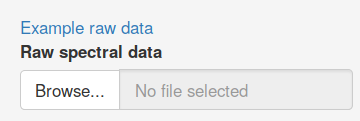
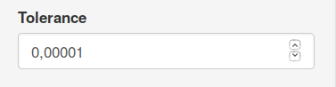
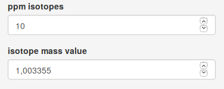
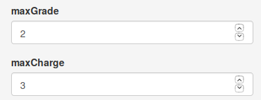
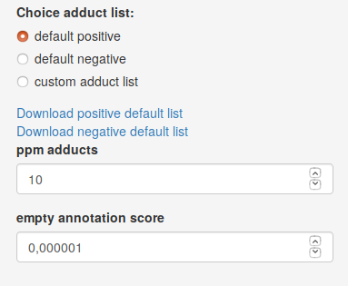

# cliqueMS Web

This code contains the Shiny App for cliqueMS package.

## Installation

CliqueMS Web does not require any installation.

If you have R packages `cliqueMS` and `shiny` installed launch

```R

shiny::runGitHub("cliqueMSWeb","osenan")
```

To use cliqueMS Web locally.

## Tutorial

### Introduction

CliqueMS Web annotates processed LC/MS data. It provides annotation
for isotopes, ion-adducts and fragmentation adducts. The algorithm
consists on first separating the features in clique-Groups. Then,
for each within each group it find isotope annotation and finally
adduct annotation.
The web application is based on `cliqueMS` package functions.
As in the package, CliqueMS Web analyses samples individually,
however, if you need to annotate a large amount of samples,
it is recommended to use the R package version.

### Step 1: Uploading spectral data files

The first step for CliqueMS Web is that you upload your spectral data
in two formats, raw and processed by XCMS. The processed data is
needed to provide the feature list. In addition, CliqueMS Web requires
profile data. For memory optimisation, processed xcms objects `xcmsSet`
do no contain complete profile data. That is why you need to upload
the raw data.

You can use the spectral example data for practise:



Once the spectral data is uploaded you the Annotation button will be
activated. Now it is time to set the annotation parameters.

### Step 2: Set annotation parameters

#### Clique parameters

CliqueMS Web uses a network-based algorithm to group features that are
likely to belong to the same metabolite. These groups correspond to
cliques (fully connected components) in a network created from the
spectral data. As there are many clique configurations, cliqueMS uses
a probabilistic model to find the clique groups with the maximum log-likelihood.
CliqueMS Web will try several clique groups until the log-likelihood cannot
be increased or until this increment is very small.

The `tol` parameter sets the minimum relative increase in log-likelihood.



#### Isotope parameters

An important number of features inside groups correspond to metabolite
isotopes. CliqueMS Web annotates carbon isotopes. Two features are
considered isotopes if the difference in m/z and intensity
fits the mass difference specified by `isotope mass value` parameter within the
range of a relative error specified by `ppm isotopes`.



The `maxGrade` par controls the maximum number of isotopes allowed for a
monoisotopic feature, and the `maxCharge` parameter controls the different
charge values (from 1 to `maxCharge`) when two m/z values are compared.



#### Annotation parameters

To set the annotation parameters, first choose `polarity` according to
the ionization of your spectral data. The annotation of adducts by
CliqueMS Web finds groups of two or more features whose m/z value is
compatible with a molecular mass and two or more adducts from the adduct list
within the range of a relative error controlled by `ppm adducts` parameter.
As the number of putative adducts and molecular masses grows very rapidly
with the clique group size, cliqueMS Web only reports the five top annotation
for each clique. The top scoring annotations are obtained in the following way:

* Report one molecular mass per clique or the minimum number of molecular masses.

* Report the molecular masses that contain the most frequent adducts in the
adduct list (defined as the logarithmic frequency).

* Report the molecular masses that annotate the largest number of
features (empty annotations are penalized, so if you use a `custom adduct list`,
change the `empty annotation score` parameter to a lower value than the
frequency of the least frequent adduct of your custom adduct list).



### Step 3: Results

Once data files are uploaded and parameters are set, you can press `Annotate data`
to obtain annotation results. If you follow the tutorial with the example data,
the results showed here are obtained with default parameters.

#### Clique results

