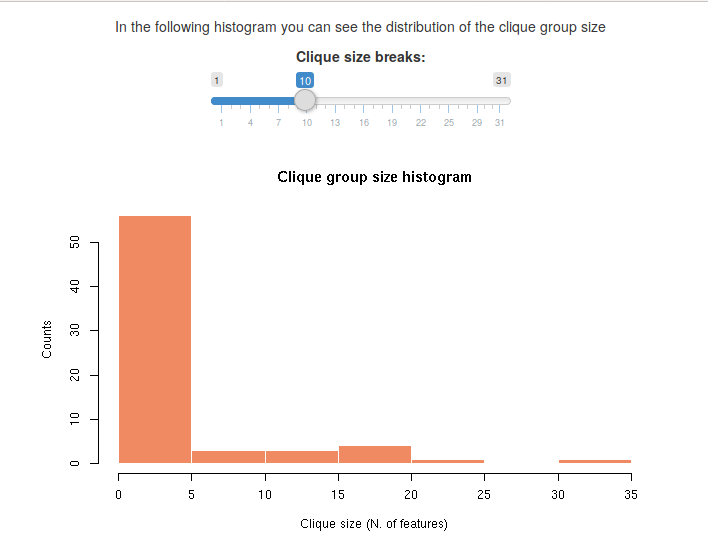
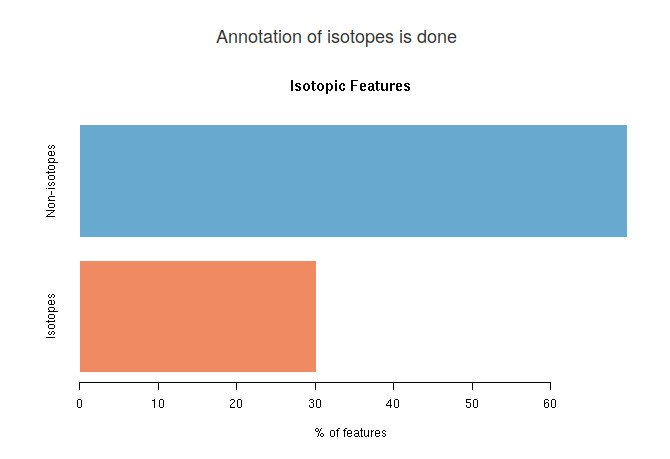
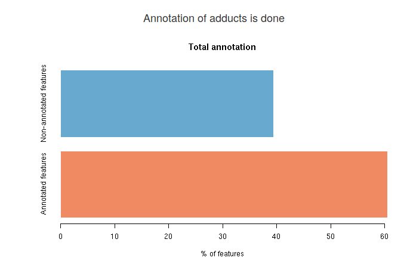
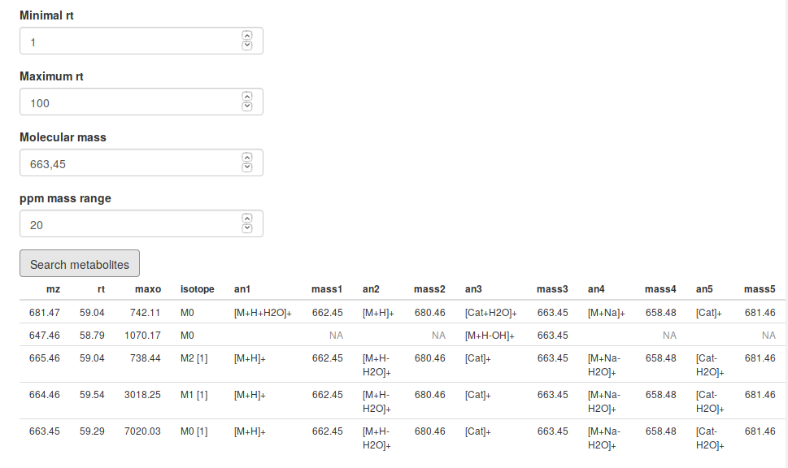
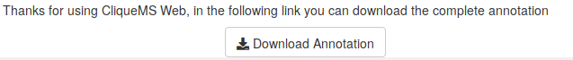

# cliqueMS Web

This code contains the Shiny App for cliqueMS package.

## Installation

CliqueMS Web does not require any installation.

If you have R packages `cliqueMS` and `shiny` installed launch

```R

shiny::runGitHub("cliqueMSWeb","osenan")
```

To use cliqueMS Web locally.

## Tutorial

### Introduction

CliqueMS Web annotates processed LC/MS data. It provides annotation
for isotopes, ion-adducts and fragmentation adducts. The algorithm
first separates the features in clique groups. Then,
for each group it finds isotope annotation and finally
adduct annotation.
The web application is based on `cliqueMS` R package functions.
As in the package, CliqueMS Web analyses samples individually.
However, it is recommended to use the R package version
if you need to annotate a large amount of samples.

### Step 1: Uploading spectral data files

The first step for CliqueMS Web is that you upload your spectral data
in two formats, raw and processed by XCMS. This is because
CliqueMS Web requires the profile data, which for memory optimisation
is not included in processed XCMS objects, that only have the peak picking
and related information.

You can use the spectral example data for practise:


Once the spectral data is uploaded the Annotation button will be
activated. Now it is time to set the annotation parameters.

### Step 2: Set annotation parameters

#### Clique parameters

CliqueMS Web uses a network-based algorithm to group features that are
likely to belong to the same metabolite. These groups correspond to
cliques (fully connected components) in a network created from the
spectral data. As there are many clique configurations, CliqueMS uses
a probabilistic model, and finds the clique groups that maximise the 
log-likelihood of that model.
CliqueMS Web will try several clique groups until the log-likelihood cannot
be increased or until this increment is very small.

The `tol` parameter sets the minimum relative increase in log-likelihood.


#### Isotope parameters

An important number of features inside groups correspond to metabolite
isotopes. CliqueMS Web annotates carbon isotopes. Two features are
considered isotopes if the difference in m/z and intensity
fits the mass difference specified by `isotope mass value` parameter within the
range of a relative error specified by `ppm isotopes`.


The `maxGrade` par controls the maximum number of isotopes allowed for a
feature, and the `maxCharge` parameter controls the different
charge values (from 1 to `maxCharge`) when two m/z values are compared.


#### Annotation parameters

To set the annotation parameters, first choose `polarity` according to
the ionization of your spectral data. The annotation of adducts by
CliqueMS Web finds groups of two or more features whose m/z value is
compatible with a molecular mass and two or more adducts from the adduct list
within the range of a relative error controlled by `ppm adducts` parameter.
As the number of putative adducts and molecular masses grows very rapidly
with the clique group size, CliqueMS Web only reports the five top annotation
for each clique. The top scoring annotations are obtained in the following way:

* Report one molecular mass per clique or the minimum number of molecular masses.

* Report the molecular masses that contain the most frequent adducts in the
adduct list (defined as the logarithmic frequency).

* Report the molecular masses that annotate the largest number of
features. As empty annotations are penalised, if you use a `custom adduct list`,
change the `empty annotation score` parameter to a lower value than the
frequency of the least frequent adduct of your custom adduct list.


### Step 3: Results

Once data files are uploaded and parameters are set, you can press `Annotate data`
to obtain annotation results. If you follow the tutorial with the example data,
the results showed here are obtained with default parameters.

#### Clique results

The first result after the annotation will be a table showing the number of
clique groups in your spectral data.


The next result is a histogram that shows the distribution of the number of features
per clique group. You can change the number of bins to see a more general count or
a more detailed picture.



Usually, there is a larger number of cliques with one or few features, and the
number of cliques with the largest number of features is very small.

#### Isotope annotation results

When isotope annotation is done, you will see a barplot showing the distribution
of isotopic features in your spectral data. In blue is the percentage of features
that are monoisotopic masses (do not have any isotope). In red, you will see
the percentage of features that at least have another feature that is an isotope.



#### Adduct annotation results

You will see three results for adduct annotation. The first barplot shows an overall
annotation result. In the blue bar you see the average percentage (among top five
annotations) of features that are not annotated. In the red bar is the
average percentage of features that are annotated.



The next result is an interactive data table to search for annotated metabolites.
First you have to set a retention time range, with the `Minimal rt` parameter
and with the `Maximum rt` parameter. Within this time window, you will see all
features that have a molecular mass as your `Molecular mass` parameter within an
error defined by `ppm mass range` parameter. In the picture you see all features
that between 1 and 100 seconds have a molecular mass of 663,45 Da within 20 ppm.



Finally, with the Download Annotation button you can download a csv table with the
complete annotation for all features in your data.

